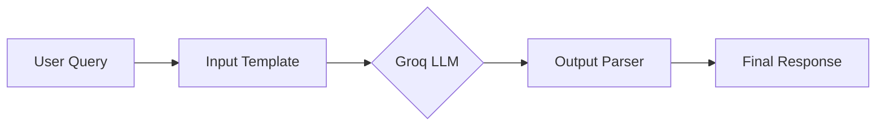
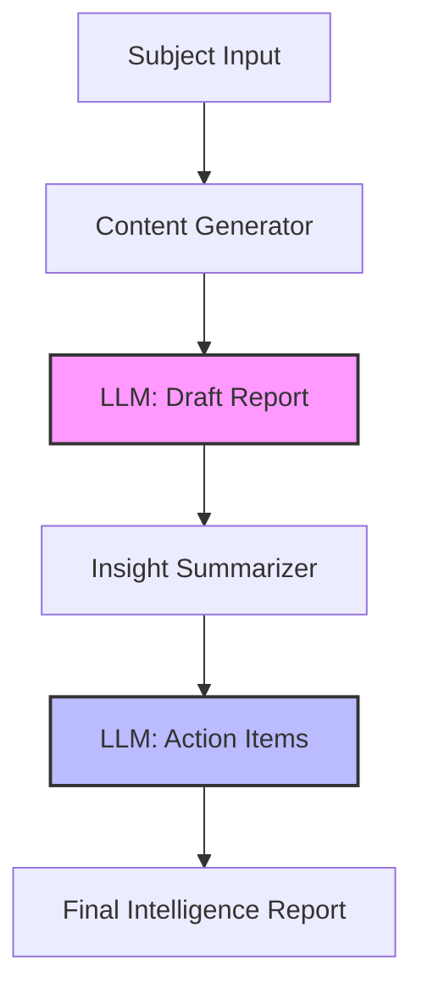

# 🤖 Agent Intelligence & Tracking Hub

[](https://www.python.org/downloads/)
[](https://python.langchain.com/)
[](https://groq.com/)
[](https://smith.langchain.com/)

A professional-grade repository demonstrating advanced orchestration of Large Language Models (LLMs) using **LangChain** and **Groq**, with full observability provided by **LangSmith**. This project serves as a blueprint for building scalable, traceable, and production-ready AI agents.

---

## 🛠 Tech Stack

*   **Orchestration**: [LangChain](https://github.com/langchain-ai/langchain)
*   **Inference Engine**: [Groq Cloud](https://groq.com/) (Llama-3.3-70B-Versatile)
*   **Observability & Tracing**: [LangSmith](https://smith.langchain.com/)
*   **Environment Management**: `python-dotenv`
*   **Development Language**: Python 3.9+

---

## 🏗 System Workflows

### 1. Basic Inference Pipeline
A streamlined flow for zero-shot completions using structured prompt templates and output parsers.



### 2. Sequential Intelligence Pipeline
A multi-stage chain where the output of a high-level content generator is fed into a specialized analyst for insight extraction.



---

## 🚀 Getting Started

### 1. Clone & Setup
```bash
git clone https://github.com/Zahir-Ahmad9897/Agent-Tracking-Using-LangSmith.git
cd Agent-Tracking-Using-LangSmith
```

### 2. Virtual Environment
```bash
python -m venv venv
# Windows
.\venv\Scripts\activate
# Linux/macOS
source venv/bin/activate
```

### 3. Dependencies
```bash
pip install -r requirements.txt
```

### 4. Configuration
Create a `.env` file in the root directory:
```env
GROQ_API_KEY=your_groq_api_key
LANGCHAIN_TRACING_V2=true
LANGCHAIN_API_KEY=your_langsmith_api_key
LANGCHAIN_PROJECT=Sequential-Intelligence-Pipeline
```

---

## 📂 Core Implementation

### [1. llm_basic_call.py](file:///1_llm_basic_call.py)
*   **Purpose**: Demonstrates atomic LLM interaction.
*   **Best Practice**: Uses `ChatPromptTemplate` for separation of concerns between system instructions and user input.
*   **Execution**: `python 1_llm_basic_call.py`

### [2. sequential_workflow.py](file:///2_sequential_workflow.py)
*   **Purpose**: Implements a multi-step reasoning pipeline.
*   **Best Practice**: Utilizes LCEL (LangChain Expression Language) for clean piping and granular LangSmith tracing (tags, metadata).
*   **Execution**: `python 2_sequential_workflow.py`

---

## 🛡 Best Practices Implemented

1.  **Observability**: Full tracing enabled via LangSmith to debug latency and token usage.
2.  **Environment Isolation**: Secrets managed via `.env` to prevent credential leakage.
3.  **Modular Architecture**: Logic is separated into templates, engines, and parsers.
4.  **Error Handling**: Basic `try-except` blocks to manage network/API failures.

---

## 📈 Monitoring
Visit your [LangSmith Dashboard](https://smith.langchain.com/) to monitor the `Sequential-Intelligence-Pipeline` project. You can view:
- Per-step latency
- Exact input/output payloads
- Token consumption metrics

---
Built with Senior-Level Engineering Standards 🚀
