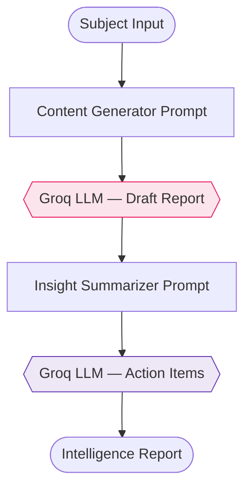
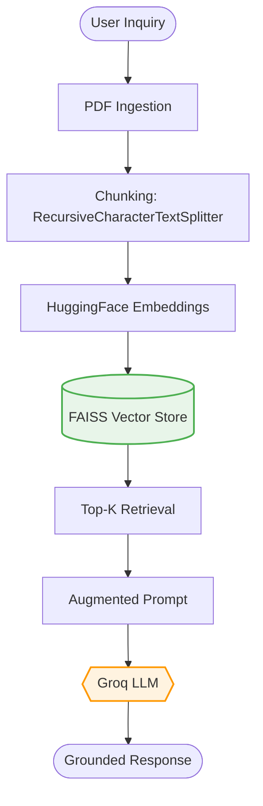
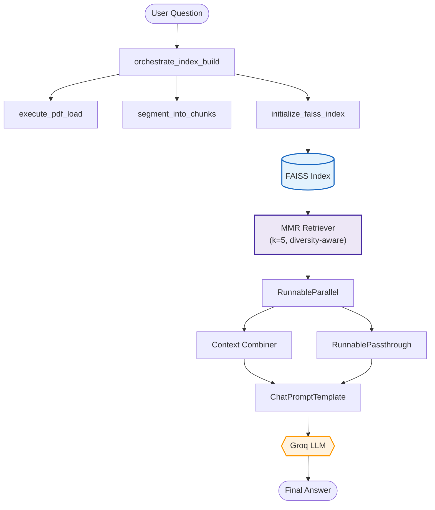
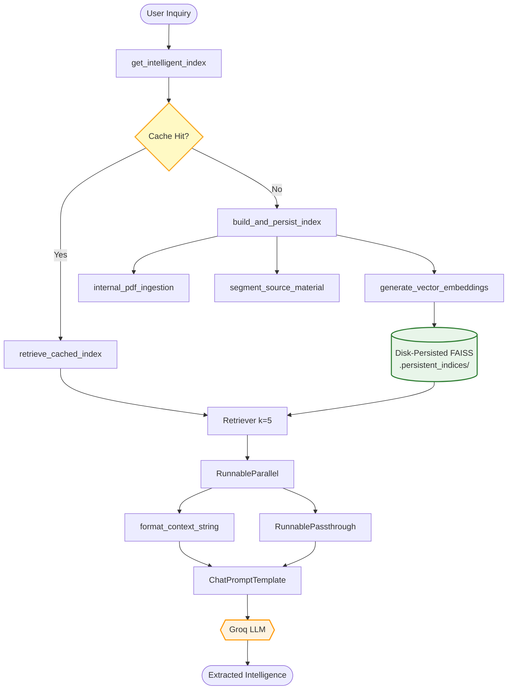
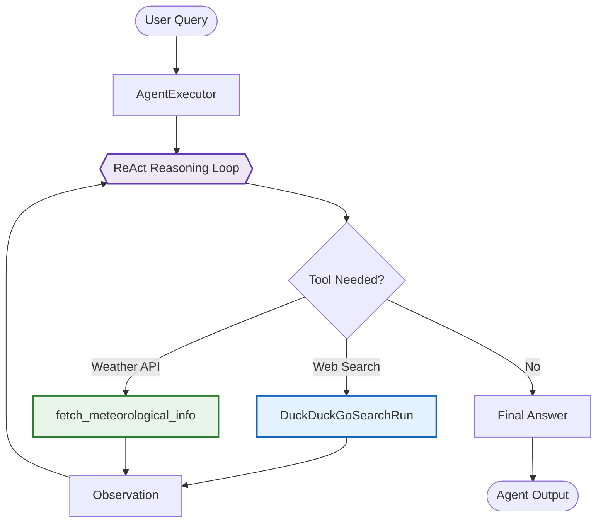
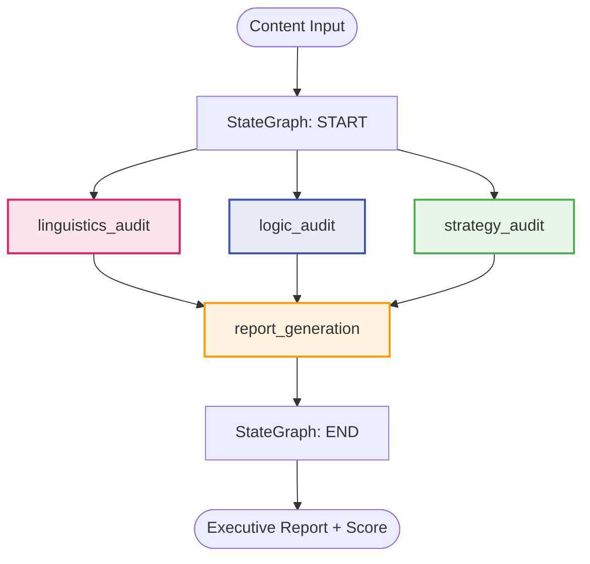

# 🤖 Agent Intelligence & Tracking Hub

<p align="center">
  <a href="https://www.python.org/downloads/"></a>
  <a href="https://python.langchain.com/"></a>
  <a href="https://groq.com/"></a>
  <a href="https://smith.langchain.com/"></a>
<<<<<<< HEAD
   
</p>

<p align="center">
  A progressive, production-grade building <strong>traceable</strong>, <strong>scalable</strong>, and <strong>observable</strong> LLM pipelines using <strong>LangChain</strong>, <strong>Groq</strong>, and <strong>LangSmith</strong>.<br/>
  Each script is a standalone module that teaches a core concept — from a single LLM call all the way to full RAG systems.
=======
  <a href="https://www.langchain.com/langgraph"></a>
  <a href="https://github.com/Zahir-Ahmad9897/Agent-Tracking-Using-LangSmith/blob/main/LICENSE"></a>
</p>

<p align="center">
  A progressive, production-grade masterclass in building <strong>traceable</strong>, <strong>scalable</strong>, and <strong>observable</strong> LLM pipelines using <strong>LangChain</strong>, <strong>LangGraph</strong>, <strong>Groq</strong>, and <strong>LangSmith</strong>.<br/>
  Each script is a standalone module that teaches a core concept — from a single LLM call all the way to autonomous agents and multi-node stateful graph workflows.
>>>>>>> c364f63 (docs: Comprehensive README update with modules 7 and 8 documentation)
</p>

---

## 📑 Table of Contents

- [Overview](#-overview)
- [Tech Stack](#-tech-stack)
- [Architecture](#-architecture)
- [Getting Started](#-getting-started)
- [Module Reference](#-module-reference)
- [LangSmith Observability](#-langsmith-observability)


---

## 🔍 Overview

<<<<<<< HEAD
This repository is a hands-on master project structured as **progressive modules**. Each module builds on the previous one, introducing new LangChain primitives, design patterns, and LangSmith tracing capabilities. By the end, you will have a solid foundation for building production-ready, fully observable AI systems.
=======
This repository is a hands-on masterclass structured as **8 progressive modules**. Each module builds on the previous one, introducing new LangChain primitives, design patterns, and LangSmith tracing capabilities. By the end, you will have a solid foundation for building production-ready, fully observable AI systems — from simple LLM calls to autonomous ReAct agents and parallel LangGraph audit workflows.
>>>>>>> c364f63 (docs: Comprehensive README update with modules 7 and 8 documentation)

| Aspect | Detail |
|---|---|
| **Language** | Python 3.9+ |
| **LLM Provider** | Groq Cloud (Llama-3.3-70B-Versatile) |
| **Orchestration** | LangChain / LCEL / LangGraph |
| **Observability** | LangSmith |
| **Vector Store** | FAISS (in-memory + disk-persisted) |
| **Embeddings** | HuggingFace (`all-MiniLM-L6-v2`) |
| **Retrieval Strategy** | Similarity Search & MMR (Maximal Marginal Relevance) |
| **Caching** | SHA-256 content-addressed FAISS index persistence |
| **Agent Framework** | ReAct pattern via `create_react_agent` + `AgentExecutor` |
| **Graph Workflows** | Parallel fan-out / fan-in via `StateGraph` (LangGraph) |

---

## 🛠 Tech Stack

| Tool | Role | Version |
|---|---|---|
| [LangChain](https://python.langchain.com/) | Pipeline orchestration & LCEL | `≥ 0.3` |
| [LangGraph](https://www.langchain.com/langgraph) | Stateful multi-node graph workflows | `≥ 0.6` |
| [Groq Cloud](https://groq.com/) | Ultra-fast LLM inference | API |
| [LangSmith](https://smith.langchain.com/) | Tracing, debugging & monitoring | `≥ 0.4` |
| [FAISS](https://github.com/facebookresearch/faiss) | Vector similarity search | `faiss-cpu` |
| [HuggingFace Hub](https://huggingface.co/) | Sentence embedding models | `all-MiniLM-L6-v2` |
| [DuckDuckGo Search](https://pypi.org/project/duckduckgo-search/) | Live web search tool for agents | `≥ 8.1` |
| [Pydantic](https://docs.pydantic.dev/) | Structured LLM output validation | `≥ 2.0` |
| `python-dotenv` | Secure environment config | `≥ 1.0` |

---

## 🏗 Architecture

### Pipeline 1 — Basic Inference

> A single structured LLM call: prompt → model → parsed output.


### Pipeline 2 — Sequential Intelligence

> Multi-stage chain: each LLM output becomes the next stage's input.



### Pipeline 3 & 4 — Retrieval-Augmented Generation

> Semantic search over a document corpus to ground LLM responses in facts.



### Pipeline 5 — MMR Vector Store RAG

> Upgrades retrieval to **Maximal Marginal Relevance (MMR)** for diverse, non-redundant context chunks.



### Pipeline 6 — Persistent Cached RAG

> Introduces **SHA-256 content-addressed disk caching** so the FAISS index is rebuilt only when the source document changes.



### Pipeline 7 — Autonomous ReAct Agent

> A self-directing agent that reasons over tools in a Thought → Action → Observation loop.



### Pipeline 8 — Parallel LangGraph Audit Workflow

> Three specialist audit nodes run **in parallel** (fan-out), then merge (fan-in) into a single executive report.



---

## 🚀 Getting Started

### Prerequisites

- Python **3.9+**
- A [Groq API key](https://console.groq.com/) (free tier available)
- A [LangSmith API key](https://smith.langchain.com/) (free tier available)
- A [Weatherstack API key](https://weatherstack.com/) (free tier — required for Module 7)

### 1. Clone the Repository

```bash
git clone https://github.com/Zahir-Ahmad9897/Agent-Tracking-Using-LangSmith.git
cd Agent-Tracking-Using-LangSmith
```

### 2. Create & Activate a Virtual Environment

```bash
python -m venv venv

# Windows
.\venv\Scripts\activate

# Linux / macOS
source venv/bin/activate
```

### 3. Install Dependencies

```bash
pip install -r requirements.txt
```

### 4. Configure Environment Variables

Create a `.env` file in the project root:

```env
# LLM Inference
GROQ_API_KEY=your_groq_api_key_here

# LangSmith Observability
LANGCHAIN_TRACING_V2=true
LANGCHAIN_API_KEY=your_langsmith_api_key_here
LANGCHAIN_PROJECT=Agent-Tracking-Using-LangSmith

# Weather API (Module 7 only)
WEATHERSTACK_API_KEY=your_weatherstack_api_key_here
```

> ⚠️ **Security Note:** Never commit your `.env` file. It is already included in `.gitignore`.

---

## 📦 Module Reference

| # | File | Concept | LangSmith Project | Run |
|---|---|---|---|---|
| 1 | `1_llm_basic_call.py` | Atomic LLM call | `Basic-LLM-Pipeline` | `python 1_llm_basic_call.py` |
| 2 | `2_sequential_workflow.py` | Multi-step LCEL chain | `Sequential-Intelligence-Pipeline` | `python 2_sequential_workflow.py` |
| 3 | `3_rag_basic.py` | Basic RAG with FAISS | `Knowledge-Retrieval-Core` | `python 3_rag_basic.py` |
| 4 | `4_rag_conversational.py` | Traced modular RAG | `Advanced-Document-QA-System` | `python 4_rag_conversational.py` |
| 5 | `5_rag_vector_store.py` | MMR-powered vector store RAG | `Deep-Retrieval-Architecture` | `python 5_rag_vector_store.py` |
| 6 | `6_rag_advanced.py` | Persistent cached RAG system | `Persistent-Knowledge-Hub` | `python 6_rag_advanced.py` |
| 7 | `7_langchain_agent.py` | Autonomous ReAct agent + tools | `Autonomous-Research-Agent` | `python 7_langchain_agent.py` |
| 8 | `8_langgraph_workflow.py` | Parallel LangGraph audit workflow | `Deep-Content-Audit-Workflow` | `python 8_langgraph_workflow.py` |

---

### Module 1 — `1_llm_basic_call.py`

**Concept:** Atomic LLM Interaction

The foundation of all LangChain pipelines — a single, structured call to a Groq-hosted LLM using a `ChatPromptTemplate` and `StrOutputParser`.

| Attribute | Detail |
|---|---|
| **Pattern** | Prompt → LLM → Parser |
| **Key APIs** | `ChatPromptTemplate`, `StrOutputParser`, `ChatGroq` |
| **Best Practice** | System and human messages are separated to enforce a clear role boundary |
| **Tracing** | Automatic via `LANGCHAIN_TRACING_V2=true` |

```bash
python 1_llm_basic_call.py
```

---

### Module 2 — `2_sequential_workflow.py`

**Concept:** Multi-Step Sequential Chain (LCEL)

Chains two LLM calls using the LCEL pipe operator (`|`). The first call drafts a report; the second extracts actionable insights from it.

| Attribute | Detail |
|---|---|
| **Pattern** | Chain-of-Thought via `RunnableSequence` |
| **Key APIs** | LCEL `\|` operator, `RunnablePassthrough`, LangSmith `tags` & `metadata` |
| **Best Practice** | Each step is tagged independently for granular tracing in LangSmith |
| **Tracing** | Per-step latency and token usage visible in LangSmith dashboard |

```bash
python 2_sequential_workflow.py
```

---

### Module 3 — `3_rag_basic.py`

**Concept:** Basic Retrieval-Augmented Generation (RAG)

Ingests a PDF, chunks it semantically, builds a FAISS vector index, and answers user questions with LLM responses grounded in the retrieved context.

| Attribute | Detail |
|---|---|
| **Pattern** | Ingest → Chunk → Embed → Retrieve → Generate |
| **Key APIs** | `PyPDFLoader`, `RecursiveCharacterTextSplitter`, `HuggingFaceEmbeddings`, `FAISS`, LCEL RAG chain |
| **Best Practice** | `chunk_overlap=250` preserves sentence context across boundaries |
| **Source Document** | `islr.pdf` (must be present in project root) |

```bash
python 3_rag_basic.py
```

---

### Module 4 — `4_rag_conversational.py`

**Concept:** Production-Grade Traced RAG

Extends Module 3 with fully modular, independently `@traceable`-decorated pipeline stages and `RunnableParallel` for concurrent retrieval and query routing.

| Attribute | Detail |
|---|---|
| **Pattern** | Modular RAG with `@traceable` + `RunnableParallel` |
| **Key APIs** | `@traceable`, `RunnableParallel`, `RunnableLambda`, `similarity` search `k=4` |
| **Best Practice** | Every stage (ingest, chunk, embed, retrieve) is individually traced — enabling surgical debugging in LangSmith |
| **Interactive** | Accepts a live user query at runtime via `input()` |

```bash
python 4_rag_conversational.py
```

---

### Module 5 — `5_rag_vector_store.py`

**Concept:** MMR-Powered Deep Retrieval Architecture

Upgrades the retrieval layer by swapping standard similarity search for **Maximal Marginal Relevance (MMR)**. MMR balances relevance with diversity, preventing redundant context chunks from flooding the prompt. Each pipeline stage is individually `@traceable` for deep LangSmith introspection.

| Attribute | Detail |
|---|---|
| **Pattern** | `orchestrate_index_build` → MMR Retriever → `RunnableParallel` → LLM |
| **Key APIs** | `FAISS.as_retriever(search_type="mmr")`, `RunnableParallel`, `RunnablePassthrough`, `RunnableLambda` |
| **Retrieval** | MMR with `k=5` — retrieves 5 maximally diverse chunks |
| **Tracing** | Per-stage `@traceable` decorators; run tagged `Production-Grade` + `RAG` with `metadata` dict |
| **Best Practice** | `chunk_overlap=200` with `chunk_size=1100` preserves cross-boundary sentence context |
| **LangSmith Project** | `Deep-Retrieval-Architecture` |
| **Interactive** | Prompts user for a question at runtime via `input()` |

```bash
python 5_rag_vector_store.py
```

---

### Module 6 — `6_rag_advanced.py`

**Concept:** Persistent Knowledge Hub — SHA-256 Content-Addressed FAISS Caching

The most production-hardened RAG module in the series. Introduces **deterministic, content-addressed disk caching** of FAISS indices. The cache key is a SHA-256 hash of the document fingerprint (file hash + size + mtime), chunking parameters, and embedding model — so the index is **never rebuilt unless the source actually changes**, dramatically reducing cold-start latency in production deployments.

| Attribute | Detail |
|---|---|
| **Pattern** | Hash-gated index loading → `RunnableParallel` → LLM |
| **Key APIs** | `hashlib.sha256`, `FAISS.save_local` / `FAISS.load_local`, `@traceable(tags=["caching"])` |
| **Cache Storage** | `.persistent_indices/<sha256_key>/` (auto-created on first run) |
| **Cache Manifest** | `index_manifest.json` written per index — records source file path & build config |
| **Tracing** | `retrieve_cached_index` and `build_and_persist_index` tagged `["caching"]` in LangSmith |
| **Best Practice** | `force_refresh=False` default; pass `force_refresh=True` to bypass cache on demand |
| **LangSmith Project** | `Persistent-Knowledge-Hub` |
| **Interactive** | Prompts user for an inquiry at runtime; prints `Optimized: Loading from cache` on cache hits |

> ⚠️ **Note:** The `.persistent_indices/` directory is automatically created at runtime and should be added to `.gitignore` to avoid committing large binary FAISS index files.

```bash
python 6_rag_advanced.py
```

---

### Module 7 — `7_langchain_agent.py`

**Concept:** Autonomous ReAct Agent with Custom Tools

Introduces **agentic reasoning** — the agent autonomously decides which tool to call, observes the result, and iterates until it produces a final answer. It uses the standard [ReAct (Reason + Act)](https://arxiv.org/abs/2210.03629) prompting framework pulled directly from LangChain Hub.

| Attribute | Detail |
|---|---|
| **Pattern** | ReAct: Thought → Action → Observation → ... → Final Answer |
| **Key APIs** | `create_react_agent`, `AgentExecutor`, `@tool`, `DuckDuckGoSearchRun`, `hub.pull` |
| **Tools** | `DuckDuckGoSearchRun` (live web search) · `fetch_meteorological_info` (Weatherstack REST API) |
| **Safety** | `max_iterations=4` caps runaway reasoning loops; `handle_parsing_errors=True` for resilience |
| **Tracing** | Full agent reasoning trace (each Thought/Action/Observation) captured in LangSmith |
| **LangSmith Project** | `Autonomous-Research-Agent` |
| **Verbosity** | `verbose=True` prints the live reasoning chain to stdout |

> 💡 **How it works:** Given the query *"Identify the home city of Albert Einstein and provide its current weather status"*, the agent searches the web for Einstein's birthplace, then calls the weather API for that city — without any hard-coded logic.

```bash
python 7_langchain_agent.py
```

**Example Reasoning Trace:**
```
Thought: I need to find Albert Einstein's home city, then get its weather.
Action: duckduckgo_search
Action Input: "Albert Einstein home city birthplace"
Observation: Albert Einstein was born in Ulm, Germany...
Thought: Now I need the current weather in Ulm.
Action: fetch_meteorological_info
Action Input: "Ulm"
Observation: {"temperature": 18, "weather_descriptions": ["Partly cloudy"]}
Final Answer: Albert Einstein's home city was Ulm, Germany. Current weather: 18°C, Partly cloudy.
```

---

### Module 8 — `8_langgraph_workflow.py`

**Concept:** Parallel Multi-Node Audit Workflow with LangGraph

The most architecturally advanced module. Uses **LangGraph's `StateGraph`** to define a parallel fan-out / fan-in workflow: three specialist audit nodes execute **concurrently**, each scoring a piece of content from a different dimension. Their results are merged via LangGraph's `Annotated[List[int], operator.add]` state reducer, then synthesised into a single executive report.

| Attribute | Detail |
|---|---|
| **Pattern** | Parallel Fan-out (`START → 3 nodes`) → Fan-in (`3 nodes → report_generation → END`) |
| **Key APIs** | `StateGraph`, `TypedDict`, `Annotated` + `operator.add`, `BaseModel` + `with_structured_output` |
| **State Schema** | `ContentAuditState` — typed dict with reducer-annotated score accumulator |
| **Structured Output** | `QualityAssessment` (Pydantic model) enforces `audit_notes: str` + `numeric_rating: int (1-10)` |
| **Audit Dimensions** | Linguistic quality · Logical coherence · Strategic depth |
| **Score Aggregation** | `Annotated[List[int], operator.add]` automatically merges scores from parallel branches |
| **Tracing** | Each node decorated with `@traceable(tags=["audit", "<dimension>"])`; run-level `tags` and `metadata` passed via `config=` |
| **LangSmith Project** | `Deep-Content-Audit-Workflow` |
| **Output** | Prints final score (average of 3 ratings) and full executive summary report |

> 💡 **Key Design Decision:** Using `operator.add` as the state reducer for `aggregated_scores` is what enables safe concurrent writes from parallel nodes without race conditions — each node appends its score to the shared list, and LangGraph merges them deterministically.

```bash
python 8_langgraph_workflow.py
```

**Example Output:**
```
========================================
       EXECUTIVE AUDIT REPORT
========================================

Final Quality Score: 7.33/10

--- Summary ---

The content demonstrates strong strategic vision regarding India's space ambitions...
[full executive report]

========================================
```

---

## 📈 LangSmith Observability

All pipelines ship LangSmith traces out of the box. Once configured, visit your [LangSmith Dashboard](https://smith.langchain.com/) to monitor:

| Metric | What It Tells You |
|---|---|
| **Per-step latency** | Where bottlenecks occur in your pipeline |
| **Token consumption** | Cost visibility per run and per stage |
| **Input / output payloads** | Full prompt + response logged for debugging |
| **Error traces** | Stack traces correlated to exact pipeline steps |
| **Agent reasoning chains** | Full Thought/Action/Observation trace for Module 7 |
| **Graph node execution** | Per-node timing and state deltas for Module 8 |

> 💡 **Tip:** Use the `metadata` and `tags` fields in your chains to filter traces by environment (`dev`, `prod`) or experiment version.

<<<<<<< HEAD
=======
---


---

## 📄 License

This project is licensed under the **MIT License** — see the [LICENSE](LICENSE) file for details.
>>>>>>> c364f63 (docs: Comprehensive README update with modules 7 and 8 documentation)
