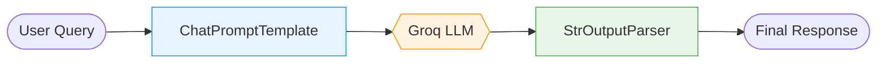

# 🤖 Agent Intelligence & Tracking Hub

<p align="center">
  <a href="https://www.python.org/downloads/"></a>
  <a href="https://python.langchain.com/"></a>
  <a href="https://groq.com/"></a>
  <a href="https://smith.langchain.com/"></a>
  <a href="https://github.com/Zahir-Ahmad9897/Agent-Tracking-Using-LangSmith/blob/main/LICENSE"></a>
</p>

<p align="center">
  A progressive, production-grade masterclass in building <strong>traceable</strong>, <strong>scalable</strong>, and <strong>observable</strong> LLM pipelines using <strong>LangChain</strong>, <strong>Groq</strong>, and <strong>LangSmith</strong>.<br/>
  Each script is a standalone module that teaches a core concept — from a single LLM call all the way to full RAG systems.
</p>

---

## 📑 Table of Contents

- [Overview](#-overview)
- [Tech Stack](#-tech-stack)
- [Architecture](#-architecture)
- [Getting Started](#-getting-started)
- [Module Reference](#-module-reference)
- [LangSmith Observability](#-langsmith-observability)
- [Best Practices](#-best-practices)
- [Contributing](#-contributing)

---

## 🔍 Overview

This repository is a hands-on masterclass structured as **progressive modules**. Each module builds on the previous one, introducing new LangChain primitives, design patterns, and LangSmith tracing capabilities. By the end, you will have a solid foundation for building production-ready, fully observable AI systems.

| Aspect | Detail |
|---|---|
| **Language** | Python 3.9+ |
| **LLM Provider** | Groq Cloud (Llama-3.3-70B-Versatile) |
| **Orchestration** | LangChain / LCEL |
| **Observability** | LangSmith |
| **Vector Store** | FAISS |
| **Embeddings** | HuggingFace (`all-MiniLM-L6-v2`) |

---

## 🛠 Tech Stack

| Tool | Role | Version |
|---|---|---|
| [LangChain](https://python.langchain.com/) | Pipeline orchestration & LCEL | `≥ 0.2` |
| [Groq Cloud](https://groq.com/) | Ultra-fast LLM inference | API |
| [LangSmith](https://smith.langchain.com/) | Tracing, debugging & monitoring | API |
| [FAISS](https://github.com/facebookresearch/faiss) | Vector similarity search | `faiss-cpu` |
| [HuggingFace Hub](https://huggingface.co/) | Sentence embedding models | `all-MiniLM-L6-v2` |
| `python-dotenv` | Secure environment config | `≥ 1.0` |

---

## 🏗 Architecture

### Pipeline 1 — Basic Inference

> A single structured LLM call: prompt → model → parsed output.



### Pipeline 2 — Sequential Intelligence

> Multi-stage chain: each LLM output becomes the next stage's input.


### Pipeline 3 & 4 — Retrieval-Augmented Generation

> Semantic search over a document corpus to ground LLM responses in facts.


---

## 🚀 Getting Started

### Prerequisites

- Python **3.9+**
- A [Groq API key](https://console.groq.com/) (free tier available)
- A [LangSmith API key](https://smith.langchain.com/) (free tier available)

### 1. Clone the Repository

```bash
git clone https://github.com/Zahir-Ahmad9897/Agent-Tracking-Using-LangSmith.git
cd Agent-Tracking-Using-LangSmith
```

### 2. Create & Activate a Virtual Environment

```bash
python -m venv venv

# Windows
.\venv\Scripts\activate

# Linux / macOS
source venv/bin/activate
```

### 3. Install Dependencies

```bash
pip install -r requirements.txt
```

### 4. Configure Environment Variables

Create a `.env` file in the project root:

```env
# LLM Inference
GROQ_API_KEY=your_groq_api_key_here

# LangSmith Observability
LANGCHAIN_TRACING_V2=true
LANGCHAIN_API_KEY=your_langsmith_api_key_here
LANGCHAIN_PROJECT=Agent-Tracking-Using-LangSmith
```

> ⚠️ **Never commit your `.env` file.** It is already excluded via `.gitignore`.

---

## 📂 Module Reference

| # | File | Concept | LangSmith Project | Run |
|---|---|---|---|---|
| 1 | `1_llm_basic_call.py` | Atomic LLM call | `Basic-LLM-Pipeline` | `python 1_llm_basic_call.py` |
| 2 | `2_sequential_workflow.py` | Multi-step LCEL chain | `Sequential-Intelligence-Pipeline` | `python 2_sequential_workflow.py` |
| 3 | `3_rag_basic.py` | Basic RAG with FAISS | `Knowledge-Retrieval-Core` | `python 3_rag_basic.py` |
| 4 | `4_rag_conversational.py` | Traced modular RAG | `Advanced-Document-QA-System` | `python 4_rag_conversational.py` |

---

### Module 1 — `1_llm_basic_call.py`

**Concept:** Atomic LLM Interaction

The foundation of all LangChain pipelines — a single, structured call to a Groq-hosted LLM using a `ChatPromptTemplate` and `StrOutputParser`.

| Attribute | Detail |
|---|---|
| **Pattern** | Prompt → LLM → Parser |
| **Key APIs** | `ChatPromptTemplate`, `StrOutputParser`, `ChatGroq` |
| **Best Practice** | System and human messages are separated to enforce a clear role boundary |
| **Tracing** | Automatic via `LANGCHAIN_TRACING_V2=true` |

```bash
python 1_llm_basic_call.py
```

---

### Module 2 — `2_sequential_workflow.py`

**Concept:** Multi-Step Sequential Chain (LCEL)

Chains two LLM calls using the LCEL pipe operator (`|`). The first call drafts a report; the second extracts actionable insights from it.

| Attribute | Detail |
|---|---|
| **Pattern** | Chain-of-Thought via `RunnableSequence` |
| **Key APIs** | LCEL `|` operator, `RunnablePassthrough`, LangSmith `tags` & `metadata` |
| **Best Practice** | Each step is tagged independently for granular tracing in LangSmith |
| **Tracing** | Per-step latency and token usage visible in LangSmith dashboard |

```bash
python 2_sequential_workflow.py
```

---

### Module 3 — `3_rag_basic.py`

**Concept:** Basic Retrieval-Augmented Generation (RAG)

Ingests a PDF, chunks it semantically, builds a FAISS vector index, and answers user questions with LLM responses grounded in the retrieved context.

| Attribute | Detail |
|---|---|
| **Pattern** | Ingest → Chunk → Embed → Retrieve → Generate |
| **Key APIs** | `PyPDFLoader`, `RecursiveCharacterTextSplitter`, `HuggingFaceEmbeddings`, `FAISS`, LCEL RAG chain |
| **Best Practice** | `chunk_overlap=250` preserves sentence context across boundaries |
| **Source Document** | `islr.pdf` (must be present in project root) |

```bash
python 3_rag_basic.py
```

---

### Module 4 — `4_rag_conversational.py`

**Concept:** Production-Grade Traced RAG

Extends Module 3 with fully modular, independently `@traceable`-decorated pipeline stages and `RunnableParallel` for concurrent retrieval and query routing.

| Attribute | Detail |
|---|---|
| **Pattern** | Modular RAG with `@traceable` + `RunnableParallel` |
| **Key APIs** | `@traceable`, `RunnableParallel`, `RunnableLambda`, `similarity` search `k=4` |
| **Best Practice** | Every stage (ingest, chunk, embed, retrieve) is individually traced — enabling surgical debugging in LangSmith |
| **Interactive** | Accepts a live user query at runtime via `input()` |

```bash
python 4_rag_conversational.py
```

---

## 📈 LangSmith Observability

All pipelines ship LangSmith traces out of the box. Once configured, visit your [LangSmith Dashboard](https://smith.langchain.com/) to monitor:

| Metric | What It Tells You |
|---|---|
| **Per-step latency** | Where bottlenecks occur in your pipeline |
| **Token consumption** | Cost visibility per run and per stage |
| **Input / output payloads** | Full prompt + response logged for debugging |
| **Error traces** | Stack traces correlated to exact pipeline steps |

> 💡 **Tip:** Use the `metadata` and `tags` fields in your chains to filter traces by environment (`dev`, `prod`) or experiment version.

---

## 🛡 Best Practices

| Practice | Implementation |
|---|---|
| **Credential Security** | All secrets in `.env`, excluded from version control via `.gitignore` |
| **Observability-First** | `LANGCHAIN_TRACING_V2=true` enabled globally; per-step `tags` and `metadata` added on complex chains |
| **Modular Design** | Each pipeline stage is a separate, testable function with a single responsibility |
| **Error Resilience** | `try-except` blocks around all external API calls with informative error messages |
| **Reproducibility** | `temperature=0.1–0.2` set on all inference calls for consistent outputs |
| **Semantic Chunking** | `chunk_overlap` used across all RAG modules to prevent context loss at boundaries |

---

## 🤝 Contributing

Contributions, issues, and feature requests are welcome!

1. Fork the repository
2. Create your feature branch: `git checkout -b feature/your-feature-name`
3. Commit your changes: `git commit -m 'feat: add your feature'`
4. Push to the branch: `git push origin feature/your-feature-name`
5. Open a Pull Request

---

<p align="center">
  Built with Senior-Level Engineering Standards 🚀<br/>
  <a href="https://github.com/Zahir-Ahmad9897/Agent-Tracking-Using-LangSmith">⭐ Star this repo if it helped you!</a>
</p>
